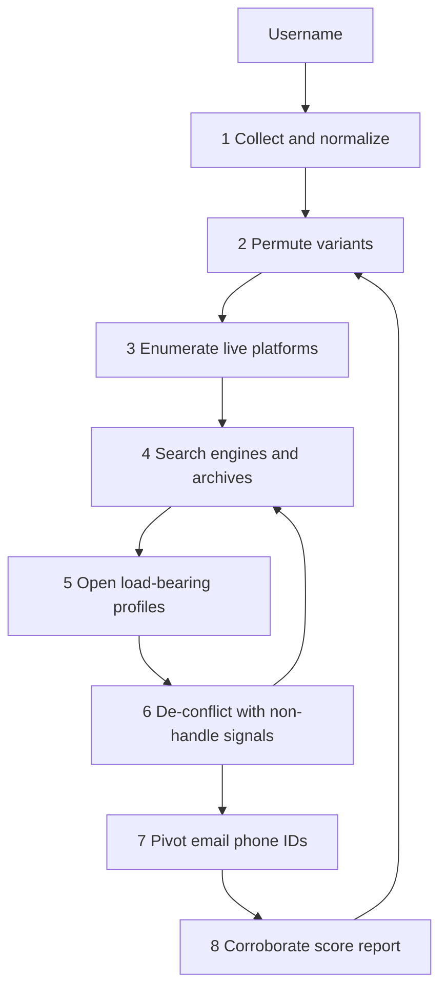

# Username OSINT Guide 101

**The complete username OSINT guide for investigators, journalists, SOC analysts, and researchers.** Learn how to hunt a handle across platforms, generate the variants people actually use, de-conflict collisions, and turn a string like `mike87` into a defensible identity graph — or into a documented *non*-attribution.

This is a field manual, not a Sherlock screenshot. Most “username OSINT” pages run one tool and call 200 green checkmarks a person. This guide teaches the **workflow, permutation, corroboration, and evidence rules** that separate a handle collision from an investigation you can stand behind.

> **Scope.** Passive, lawful, public-source intelligence only. Do not log into accounts you do not own. Do not impersonate the subject. Do not complete password resets. Do not harass, stalk, or catfish anyone.

**Maintained by [OSINTverse](https://osintverse.com)** · License: [CC BY 4.0](LICENSE)

Sister guides: [Email OSINT Guide 101](https://github.com/osintverse/Email-OSINT-Guide-101) · [Phone Number OSINT Guide 101](https://github.com/osintverse/Phone-Number-OSINT-Guide-101)

---

## What this username OSINT guide covers

- How **username OSINT** works, and why a reused handle is often the only thread between a 2009 forum and a 2026 GitHub
- How to **score a handle’s uniqueness** before you waste a day on `alex`
- How to **permute** separators, years, leetspeak, and platform-length truncations
- An **8-phase investigation workflow** you can run in 20 minutes or expand into a full case file
- How to use **Sherlock, Maigret, WhatsMyName, and Blackbird** as lead generators, not oracles
- How to **de-conflict** accounts with photos, timestamps, writing, networks, and external URLs
- Platform playbooks for **GitHub, Reddit, X, Instagram, TikTok, Steam, Discord, Telegram**
- How to recover **deleted and renamed** handles from archives
- A **confidence scoring** model so a common-word hit does not become a named person

**Deep dives**

| Guide | Use it when |
| --- | --- |
| [Investigation checklist](docs/checklist.md) | You want a printable case worksheet |
| [Username OSINT tools](docs/tools.md) | You need the full tool directory |
| [Google dorks for username OSINT](docs/dorks.md) | You are hunting mentions, not just profile URLs |
| [Handle permutations](docs/permutations.md) | You only have one string and need the rest |
| [Platform playbooks](docs/platforms.md) | The hit is on GitHub, Reddit, Steam, Discord… |
| [FAQ](docs/faq.md) | You need a short answer to a specific question |

---

## Table of contents

1. [What is username OSINT?](#what-is-username-osint)
2. [Legal, ethical, and operational rules](#legal-ethical-and-operational-rules)
3. [Why a handle is a dangerous pivot](#why-a-handle-is-a-dangerous-pivot)
4. [Anatomy of a username](#anatomy-of-a-username)
5. [Score uniqueness first](#score-uniqueness-first)
6. [Investigator OPSEC](#investigator-opsec)
7. [The 8-phase username OSINT workflow](#the-8-phase-username-osint-workflow)
8. [Phase 1 — Collect and normalize](#phase-1--collect-and-normalize)
9. [Phase 2 — Generate permutations](#phase-2--generate-permutations)
10. [Phase 3 — Enumerate live platforms](#phase-3--enumerate-live-platforms)
11. [Phase 4 — Search engines and archives](#phase-4--search-engines-and-archives)
12. [Phase 5 — Open every load-bearing profile](#phase-5--open-every-load-bearing-profile)
13. [Phase 6 — De-conflict and attribute](#phase-6--de-conflict-and-attribute)
14. [Phase 7 — Pivot to email, phone, and IDs](#phase-7--pivot-to-email-phone-and-ids)
15. [Phase 8 — Corroborate, score, and report](#phase-8--corroborate-score-and-report)
16. [Confidence scoring](#confidence-scoring)
17. [What goes wrong](#what-goes-wrong-in-username-osint)
18. [Worked example](#worked-example-a-20-minute-triage)
19. [Starter tool stack](#starter-tool-stack)
20. [Reduce your own username OSINT surface](#reduce-your-own-username-osint-surface)
21. [Keep this guide current](#keep-this-guide-current)

---

## What is username OSINT?

**Username OSINT** (username open-source intelligence) is the structured use of publicly available information to learn where a handle exists, which of those accounts are the *same person*, what other identifiers they expose, and which hits are collisions, recycle jobs, or impersonators.

Two directions, same toolkit:

| Direction | You start with | You want |
| --- | --- | --- |
| **Handle enumeration** | One username | Platforms, variants, a graph |
| **Handle discovery** | A name, email local-part, or display name | Candidate usernames to enumerate |

It is **not**:

- Logging into someone else’s account
- “Trying the username as the password”
- Impersonating them to get a friend to talk
- Treating Sherlock’s found-list as a biography

A competent username investigation answers five questions:

| Question | What “good” looks like |
| --- | --- |
| Where does this *string* exist? | Confirmed profile URLs, not tool checkmarks |
| Is the string rare enough to matter? | Uniqueness score, with common-word handles flagged |
| Which accounts are the same operator? | Two independent non-handle signals |
| What else did they publish? | Email, phone, domain, photo, SteamID, Git commit |
| What would *disprove* the link? | A conflicting face, timezone, or language written down |

Finding the string on 300 platforms is not stronger than finding it on 12. The count may mean the word is common. **Relationships between accounts** are the intelligence.

---

## Legal, ethical, and operational rules

Usernames are often chosen to be public. The *people* behind them still have rights. Combining public profiles into a dossier is personal-data processing under GDPR-style laws.

**Have a lawful basis before you start.** Typical legitimate uses: phishing and impersonation investigation, journalism in the public interest, authorized threat intelligence, incident response, due diligence you are legally allowed to perform, and researching your own footprint.

**Hard stops**

- Do not access an account you do not own. That is a crime in almost every jurisdiction.
- Do not impersonate the subject or their friends. That is fraud, not OSINT.
- Do not complete password resets or use breach passwords.
- Do not use this guide for stalking, harassment, doxxing, or employment / tenant / credit screening. OSINT tools are **not** FCRA consumer reports.
- Automated enumeration at high volume can violate a site’s terms and get your egress banned. Keep it low. Prefer official profile URLs and search engines.

**Document purpose.** Write one sentence at the top of the case file: *why* you are looking at this handle, *who* authorized it, and *what* you will not do.

This guide is educational. You are responsible for the law where you operate.

---

## Why a handle is a dangerous pivot

People reuse usernames the way they reuse belt notches: habitually, proudly, and longer than they should. A 2011 Xbox tag becomes a 2018 Reddit, a 2021 Discord, and a 2024 GitHub. That continuity is why username OSINT works.

It is also why username OSINT *fails*:

1. **Collision.** `mike87` is a demographic, not a person.
2. **Recycling.** Platforms free abandoned names. The 2015 owner is not the 2026 owner.
3. **Impersonation.** Fan accounts, scammers, and “official” lookalikes copy the string and the avatar.
4. **Soft 404s.** Tools infer “exists” from HTTP. Sites lie.

The handle is the *search key*. Attribution needs evidence **independent of the handle**.

---

## Anatomy of a username

```text
[prefix] [core] [separator] [qualifier] [suffix]
  the     jane     _          kay        94
```

| Piece | Why it matters |
| --- | --- |
| **Core** | Name, nickname, interest, or random. This is what you permute |
| **Separator** | `.` `_` `-` or none. People are loyal to one |
| **Qualifier** | Middle initial, city, fandom, `real`, `official`, `hq` |
| **Numeric tail** | Birth year, jersey, `1` after a taken name, `420` |
| **Leet** | `3` for `e`, `0` for `o`. A style, not a disguise |
| **Display name** | Often *different* from the handle. Both are search terms |
| **User ID** | Numeric ID (Reddit, Discord, Steam, X snowflake) outlives a rename |

**Normalize for storage, not for search.**

```text
Seen:    @Jane_Kay94
Store:   jane_kay94          (lowercase, strip leading @)
Also:    Jane_Kay94          (original case — some sites are case-preserving)
Also:    janekay94           (no separator)
Also:    jane.kay94          (dot form)
```

Never fold two different cores into one case file without a note. `jane_kay` and `janekayy` are a hypothesis, not a fact.

---

## Score uniqueness first

Do this before Maigret. A uniqueness score decides how much any later hit is worth.

| Score | Examples | How to treat hits |
| --- | --- | --- |
| **High** | `mothwing-caliper`, `jkay_trombone_leeds` | One extra signal may be enough to merge |
| **Medium** | `jane.kay94`, `jkay_dev` | Need a second independent signal |
| **Low** | `mike87`, `alex`, `shadow`, `ninja` | Handle match is almost worthless alone |
| **Collision-by-design** | Brand names, game titles, common words | Assume multiple owners until proven otherwise |

**Quick tests**

- Length and odd character combinations raise uniqueness
- A real name + year is medium, not high (`johnsmith1990` is shared)
- The same string as a *display name* on one site and a *handle* on another is still just a string
- If Google returns ten unrelated people for the quoted handle, you are in Low

Write the score at the top of the sheet. It keeps you honest when the tool dump looks impressive.

---

## Investigator OPSEC

Never enumerate a subject from your personal Instagram, GitHub, or Discord.

**Minimum viable lab**

- Separate browser profile with no personal logins
- Research / sock accounts only where a platform requires a login *and* your policy allows it
- VPN or institutional egress you are allowed to use
- Evidence folder with UTC-stamped captures
- Assume profile *views* are visible (LinkedIn, some Instagram, some dating apps). Prefer logged-out collection

**Do not follow, like, or friend** the subject from any account that can be tied to you. That is a knock on their door.

---

## The 8-phase username OSINT workflow



The process is a loop. A Linktree on GitHub produces three new handles. A 2014 archived profile produces a different numeric tail. Restart permutation.

**20-minute triage:** phases 1–5 on the *original* handle only, plus a uniqueness score.  
**Full case:** all eight phases, every serious variant, archives, and a written confidence assessment.

---

## Phase 1 — Collect and normalize

1. Copy the handle **exactly** as it appeared (`@`, spaces, emoji, Cyrillic lookalikes).
2. Note the platform and URL it came from.
3. Strip a leading `@` for the stored key; keep the original in notes.
4. Record the **display name** separately. It is a second search term.
5. If you have a real name or email local-part, write them as *candidate cores*, not as facts.
6. Score uniqueness.

Homoglyphs matter. `jаne` with a Cyrillic `а` is not `jane`. Search both if the source is a screenshot.

---

## Phase 2 — Generate permutations

People do not invent a new identity per site. They apply a **rule**. Infer the rule from two known handles, then generate the rest. Full cookbook: [Handle permutations](docs/permutations.md).

Minimum batch from `jane_kay94`:

```text
jane_kay94
janekay94
jane.kay94
jane-kay94
janekay
jane_kay
jkay94
j_kay94
kayjane94
thejanekay
jane_kay_official
jan3_kay94
JaneKay94
```

Add platform-forced **truncations**. A long core gets cut the same way every time:

| Platform | Typical handle cap |
| --- | --- |
| X | 15 |
| Reddit | 20 |
| TikTok | 24 |
| Instagram | 30 |
| GitHub | 39 |
| Discord display | 32 (username system is separate) |

Keep **confirmed** handles and **speculative** permutations in two lists. Never let a guessed variant inherit the confidence of the original.

---

## Phase 3 — Enumerate live platforms

Three tools answer slightly different questions. Serious cases run more than one.

| Tool | Question it answers | Best use |
| --- | --- | --- |
| **[WhatsMyName](https://whatsmyname.app)** | Where does this string appear to exist? | Fast no-install first pass; community detection rules |
| **[Sherlock](https://github.com/sherlock-project/sherlock)** | Same, scriptable, 400+ sites | Baseline CLI sweep, CSV/XLSX, `{?}` fuzzy separators |
| **[Maigret](https://github.com/soxoj/maigret)** | Exists *and* what is on the page? | Depth: parse bios, extract IDs, recurse, HTML report |
| **[Blackbird](https://github.com/p1ngul1n0/blackbird)** | Username *or* email, WhatsMyName dataset | Clean exports when you want a file, not a terminal |

```bash
# Fast baseline
sherlock jane_kay94 --csv

# Depth — top sites, then all if the case deserves it
maigret jane_kay94
maigret jane_kay94 -a --html

# Parse a known profile and recurse on extracted IDs
maigret --parse https://github.com/jane_kay94
```

**How to read the output**

- A “found” means *a URL pattern looked taken*. Open it.
- A “not found” is **not** proof of absence. Modules rot. Rate limits lie.
- Two tools disagree: believe the browser, not the louder CLI.
- Save the raw output. You will want to diff a second run later.

Do not fire these at a hundred guessed variants from your home IP. One subject, a short permutation list, documented purpose.

---

## Phase 4 — Search engines and archives

Enumerators only see **current** profile URLs. The useful account is often deleted, renamed, or sitting in a forum signature with no profile page.

Search the quoted handle and the serious variants. Cookbook: [Google dorks for username OSINT](docs/dorks.md).

```text
"jane_kay94"
"jane_kay94" site:github.com
"jane_kay94" site:reddit.com
"@jane_kay94"
inurl:jane_kay94
"jane_kay94" (steam OR xbox OR psn OR battlenet)
"jane_kay94" filetype:pdf
```

**Archives**

- [Wayback Machine](https://web.archive.org) on every important profile URL
- CDX for a site’s user path: `https://web.archive.org/cdx/search/cdx?url=twitter.com/jane_kay94/*&output=json`
- [archive.today](https://archive.ph) when Wayback is blocked
- Reddit: append `.json` to a user URL for `created_utc` and old posts
- Deleted X/Twitter: archived tweet collections (twayback-class tools) if the case needs them

A 2016 snapshot of a now-recycled handle is often the *real* subject. The live 2026 account may be a stranger.

---

## Phase 5 — Open every load-bearing profile

Pick the accounts that could actually carry the case: GitHub, a personal domain, a Linktree, a long Reddit history, a Steam profile, a platform with a photo. Ignore the 80th “found” on a site you have never heard of until those are done.

For each opened profile, record:

| Field | Why |
| --- | --- |
| URL + archive | The page will change |
| Display name vs handle | Two search terms |
| Avatar (saved file) | Reverse image |
| Bio / About, verbatim | Unique strings, other URLs |
| Outbound links | Linktree, “my YouTube,” email |
| Join / created date | Sequence and recycle checks |
| Location / language | De-confliction |
| Numeric user ID | Survives rename |
| Last activity | Dead vs live |

Reverse-image every non-default avatar on Google Lens, Yandex, and TinEye (TinEye’s oldest-first sort shows who used the photo first).

Platform-specific notes: [Platform playbooks](docs/platforms.md).

---

## Phase 6 — De-conflict and attribute

This is the step most guides skip. You need signals **that are not the username**.

Aim for **two independent categories** before you merge two accounts:

| Category | Strong example | Weak example |
| --- | --- | --- |
| **Image** | Same cropped selfie | Same anime avatar used by thousands |
| **External URL** | Same personal domain or Linktree | Same Amazon storefront everyone shares |
| **Identifier** | Same email, phone, SteamID, PGP | Same first name |
| **Time** | Same posting-hour histogram + same weekday rhythm | Both posted on a Tuesday once |
| **Network** | Overlap on *small* accounts they follow | Both follow a celebrity |
| **Language** | Same rare misspelling, same sign-off | Both write in English |
| **Narrative** | “I moved from Xbox to Steam, same tag” | “Gamer” in both bios |

**Hunt the disconfirming account.** If you cannot say what would prove these are *different* people, you have a vibe.

Classic splitters:

- Different faces
- Simultaneous live activity in incompatible time zones
- One account is a brand; the other is a teenager
- Creation date *after* the subject publicly abandoned the handle
- Language / script the subject has never used

Keep unmerged clusters in the file. “Cluster A = developer in Leeds. Cluster B = FIFA account in Manila. Same string.” That is a successful finding.

---

## Phase 7 — Pivot to email, phone, and IDs

Once a cluster is Medium or High, harvest the *other* identifiers and run the sister guides.

| If you find… | Then |
| --- | --- |
| Email in a Git commit, PGP UID, or bio | [Email OSINT Guide 101](https://github.com/osintverse/Email-OSINT-Guide-101) |
| Phone on a classifieds or WhatsApp-in-bio | [Phone Number OSINT Guide 101](https://github.com/osintverse/Phone-Number-OSINT-Guide-101) |
| SteamID64 | Trade, ban, and stats sites keyed on the ID, not the vanity |
| Discord snowflake | Decode creation time; do not expect a public profile from username alone |
| Personal domain | WHOIS, CT, the email guide’s domain chapter |
| Gravatar / photo | Reverse image; hash if you also have an email |

Maigret’s `--parse` and recursive mode exist for this phase. Still open the extracted links yourself.

---

## Phase 8 — Corroborate, score, and report

Write **claims with sources**, not a biography:

```text
Claim: GitHub @jane_kay94 and Reddit u/jane_kay94 are the same operator
Sources: identical Linktree (archived); same avatar crop (TinEye first-seen 2019)
Confidence: High
Caveat: Instagram @jane_kay94 is a different face — not merged
```

Include the collision you rejected. Future-you will thank you when someone asks “why didn’t you mention the Instagram?”

Use the [investigation checklist](docs/checklist.md) as the case file template.

---

## Confidence scoring

Score **each claimed link between two accounts**, not “the person.”

| Score | Meaning | Example |
| --- | --- | --- |
| **High** | Two independent non-handle signals, or the subject published the link | Same domain in GitHub and About.me; “this is my Reddit” in a tweet |
| **Medium** | One strong non-handle signal, unique handle | Same uncommon photo; Medium handle uniqueness |
| **Low** | Handle match only, or one weak signal | `mike87` on Twitch and Instagram; same first name |
| **Rejected** | Contradicted or recycled | New account created after documented abandonment; different face |

A Low uniqueness handle **cannot** reach High on handle-match plus one anime avatar.

---

## What goes wrong in username OSINT

**Common handles.** You attributed a demographic.

**Tool false positives.** Soft 404, login wall, or a parked “username available” page.

**Tool false negatives.** The Instagram they actually use was rate-limited out of the scan. Check important sites by hand.

**Recycled names.** You profiled the new tenant of an old handle.

**Impersonators.** Same string, same stolen photo, created last week.

**Count-as-confidence.** 180 Maigret hits on `shadow` prove the word is popular.

**Display name ≠ handle.** You searched one and missed the other.

**Homoglyphs and lookalikes.** `rn` vs `m`, Cyrillic `а`, zero vs `o`.

**You became visible.** You viewed their LinkedIn as yourself.

**Chain of custody.** They renamed yesterday. Archive now.

---

## Worked example: a 20-minute triage

*Fictional handle for teaching.*

**Input:** phishing report signed by `mothwing-caliper` on a paste.

| Minute | Action | Result |
| --- | --- | --- |
| 0–3 | Normalize + uniqueness | High. Odd compound. Display name unknown |
| 3–6 | Permute lightly | `mothwingcaliper`, `mothwing_caliper`, `mothwing-caliper` |
| 6–10 | WhatsMyName + Sherlock | GitHub, Reddit, Chess.com “found.” Instagram miss |
| 10–13 | Open GitHub | Bio: “Leeds / maps.” Linktree. Avatar is a moth photo, not a face |
| 13–16 | Open Reddit | Same Linktree. Same moth photo. `created` 2018. r/osint + r/leeds |
| 16–18 | Instagram `@mothwing-caliper` by hand | No account. `@mothwingcaliper` is a fashion shop in Jakarta — **different cluster** |
| 18–20 | Report | **High:** GitHub + Reddit same operator (Linktree + image). **Rejected:** Instagram shop. Next: email from Git commits via the email guide. Do not contact |

That is a successful investigation. You refused the glamorous wrong Instagram.

---

## Starter tool stack

| Job | Free starting point | When to pay |
| --- | --- | --- |
| Uniqueness / search | Quoted Google / Bing / Yandex | — |
| Fast enumerate | WhatsMyName.app | Hosted desks |
| CLI baseline | Sherlock | — |
| Depth + recurse | Maigret | — |
| Email+username | Blackbird, user-scanner | — |
| Archives | Wayback, archive.today, Reddit `.json` | Hunchly |
| Images | Lens, Yandex, TinEye | — |
| Graph | Paper, Obsidian, Maltego CE | Maltego paid |
| Email / phone pivots | Sister OSINTverse guides | Licensed breach platforms |

Full annotated directory: [Username OSINT tools](docs/tools.md).

---

## Reduce your own username OSINT surface

If you can do this to others, others can do it to you.

- Use **different cores** for work, gaming, and politics — not a separator change
- Do not reuse the email local-part as a global handle
- Change the avatar per cluster; one selfie is a merge key
- Do not put the same Linktree on every persona
- Old forums do not forget. Assume 2009 still exists in Wayback
- When you abandon a handle, **do not** leave the bio pointing at the new one if you wanted a clean break
- GitHub private email; no vanity Steam URL if you care

---

## Keep this guide current

Site-check modules rot. Instagram breaks Sherlock. Platforms change length limits. Recycle policies change. Any username OSINT guide that says “a WhatsMyName hit means it is them” is already wrong.

When you find a dead checker or a better public source, open an issue or a pull request. See [CONTRIBUTING.md](CONTRIBUTING.md).

**Related OSINTverse**

- [Email OSINT Guide 101](https://github.com/osintverse/Email-OSINT-Guide-101)
- [Phone Number OSINT Guide 101](https://github.com/osintverse/Phone-Number-OSINT-Guide-101)
- [OSINTverse](https://osintverse.com)
- Questions: [hi@osintverse.com](mailto:hi@osintverse.com)

---

## License

This guide is © 2026 OSINTverse and released under [CC BY 4.0](LICENSE). Credit **OSINTverse Username OSINT Guide 101** and link back to this repository.

Not legal advice. Not an FCRA consumer report. Not an invitation to impersonate anyone.
